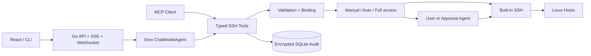

<p align="center">
  
</p>

<h1 align="center">OpsNerva</h1>

<p align="center">
  <strong>安全的本地优先 AI 运维 Agent</strong><br/>
  基于 Go 与 Eino · 内置 SSH 工具箱 · 加密审计 · 多模态交付
</p>

<p align="center">
  
  
  
  
  
  
</p>

<p align="center">
  <a href="#为什么-opsnerva">Why OpsNerva</a> •
  <a href="#核心特性">核心特性</a> •
  <a href="#审批模式">审批模式</a> •
  <a href="#快速开始">快速开始</a> •
  <a href="#开发">开发</a> •
  <a href="#文档">文档</a>
</p>

---

## 为什么 OpsNerva

OpsNerva 是一个使用 **Go 与 Eino** 构建的个人 AI 运维 Agent：LLM 通过受控工具完成 SSH 诊断、部署和恢复，**服务端统一执行审批、输入校验、加密审计和输出脱敏**。

它解决的不是"能不能让 AI 敲命令"，而是**如何让 AI 在危险运维环境中安全地敲命令**——所有执行都收敛到唯一受信的 `service.Service` 入口，模型、Skill、远端输出和 MCP Client 都被严格隔离在可信计算基之外。

- **真正会干活的 Agent** — 不止于对话：SSH 执行、脚本、文件读写与编辑、隧道转发、后台长任务、任务编排
- **默认安全的执行模型** — Manual / Auto / Full access 三种审批模式统一收敛，所有模式共用输入校验、连接绑定与加密审计
- **一个二进制多处交付** — Go 后端 + 内嵌 React 前端，可 Docker 部署，也可打包为 Windows / Linux 桌面 App

---

## 核心特性

### 🛡️ 受控执行

- **三种审批模式** — `Manual`（逐条人工授权）、`Auto`（独立 Auto Approval Agent 对照用户请求决策、超时或无效自动回退人工）、`Full access`（直接执行）
- **统一信任边界** — 所有 SSH 入口收敛到唯一 `service.Service`：解析目标→校验→审批→按需解密→加密审计，拒绝绕过
- **摘要强绑定** — 人工审批摘要绑定主机、命令、参数、环境和文件内容的 SHA-256；批准后任何字段变更都会导致执行失败

### 🔐 加密审计与脱敏

- **AES-256-GCM 落盘加密** — 命令、输出和凭据原文明文加密，模型只接收脱敏历史，密钥不出本机
- **全面脱敏** — 统一脱敏覆盖请求、输出、SSE 事件与日志，检测并清理 Authorization、Token、API Key、私钥与常见云凭据格式
- **可检索审计** — 审计页可按主机、Tool、状态和 RFC3339 时间过滤，命中的运行可结构化还原每次执行的完整上下文
- **双链路可观测** — 执行审计（SQLite 不可替代证据）与服务日志（slog 多路分发）相互独立，请求 ID 跨层关联

### 🖥️ 内置跨平台 SSH

- **零外部依赖** — 基于 `golang.org/x/crypto/ssh` 与 `pkg/sftp` 进程内实现，不调用系统 `ssh`，不依赖服务端 shell
- **完整认证方案** — `ssh-agent`（Unix Socket / Windows Named Pipe）、上传私钥、密码、托管 sudo、严格 Host Key 指纹校验
- **复杂网络拓扑** — SOCKS5 / HTTP 代理、ProxyJump 链（最多四级）、主机间文件传输中继（无需主机互通）
- **受控执行细节** — POSIX 单引号编码参数、输出字节上限、可精炼的模型视图、交互式 Shell 白名单约束

### 🧰 Workspace 与沙箱

- **托管 Workspace** — 目录内文件管理、diff 编辑、Shell、补丁应用与回滚，路径不暴露给模型
- **Bubblewrap 沙箱** — Linux 下新建 namespace、丢弃 capabilities、遮蔽敏感路径；Sandbox 是 fail-safe 默认，绝不回退 Host Shell
- **语义安全的 Shell** — 唯一开放给模型的本地 Shell，支持一次性执行与交互式 PTY，后端按设置强制复核

### 🧠 多模型

- **任意 OpenAI 兼容提供商** — 共享代理配置、连接测试、`GET /models` 模型发现、运行时热切换（原子替换 Runner）
- **视觉支持** — 可向视觉模型发送图片，历史会话中以缩略图形式完整回放
- **交互一致性** — 子 Agent（人工审批说明、Auto Approval）各自独立路由，互不干扰

### 🔌 可扩展

- **Skill 生态** — 无权限运维方法论注册表，支持上传、启停与永久删除，按需加载 `SKILL.md`
- **双向 MCP** — 动态加载外部 MCP 工具（stdio / Streamable HTTP），自身也可作为 MCP Server 接入其他客户端
- **内置工具** — Tavily 网络搜索与网页提取，可控代理与输出限额

### 💾 可恢复会话

- 会话、工具结果、Agent 任务和审批状态持久化（SQLite + Eino Checkpoint）
- 页面刷新或网络中断不中断正在运行的 Agent；断线后通过事件流重连与 Chat state 同步恢复

### 📦 多形态交付

- React 前端内嵌进单个 Go 静态二进制（Docker 构建零 CGO）
- Windows / Linux 打包为 Tauri 桌面 App

---

## 工作方式



---

## 审批模式

| 模式 | 行为 | 适用场景 |
|---|---|---|
| **Manual** | 主 Agent 和 MCP Client 的执行请求全部等待用户允许或拒绝 | 初次使用、高危操作、需要人工确认 |
| **Auto** | 独立 Auto Approval Agent 对照当前用户请求返回允许、拒绝或人工判断；缺少用户请求、模型不可用、超时或响应无效时回退人工审批 | 半自动巡检、有把握的常规恢复 |
| **Full access** | 主 Agent 和 MCP Client 直接执行 | 完全信任的日常自动化 |

三种模式都保留参数校验、主机与 Workspace 边界、SSH Host Key、连接摘要、凭据脱敏和加密审计。人工审批摘要绑定主机、命令、参数、环境和文件内容的 SHA-256。

---

## 快速开始

### 桌面 App（Windows / Linux）

从 [GitHub Releases](https://github.com/Enterpr1se0/opsnerva/releases) 下载对应平台的安装包，由 GitHub Actions 自动构建发布。

| 平台 | 格式 | 安装 |
|---|---|---|
| Linux | AppImage | `chmod +x` 后直接运行 |
| Linux | DEB（Debian / Ubuntu 系） | `sudo dpkg -i opsnerva-linux-x64.deb` |
| Windows | NSIS 安装包 | 运行 `opsnerva-windows-x64-setup.exe` |

桌面版内置 Go sidecar，后端仅监听本机随机端口；启用 MCP Server Mode 后可隐藏到系统托盘继续运行。从源码打包见[使用手册](docs/guide.md#桌面-app)。

### Docker

```bash
docker build -t opsnerva .
docker run --rm -p 8080:8080 \
  -v opsnerva-data:/app/data \
  -v opsnerva-workspace:/app/workspace \
  opsnerva
```

### 从源码构建

需要 Git、Go 1.27+、Node.js 22.13+（Linux / macOS 另需 `make`，macOS 需要 13+）：

```bash
git clone https://github.com/Enterpr1se0/opsnerva.git
cd opsnerva
make build
./bin/opsnerva
```

无参数启动会在可执行文件同目录生成 `config.yaml`、`data/` 和 `workspace/`，已有配置不会被覆盖。Windows 的构建命令见[使用手册](docs/guide.md#windows-powershell)。

### 首次使用

1. 启动 OpsNerva App。
2. 在 **配置 → 模型提供商** 填入 Base URL、Model ID 和 API Key，先**测试**再**使用此模型**；也可用 `OPENAI_API_KEY` / `OPENAI_BASE_URL` / `OPENAI_MODEL` 环境变量提供默认模型。
3. 在 **配置 → SSH 主机** 添加主机，扫描并人工核对 Host Key 指纹后信任。
4. 回到 **Agent** 新建会话，开始对话。

> App API 默认只监听本机。可通过 `config.yaml` 的 `auth` 或 `OPSNERVA_AUTH_*` 环境变量启用登录和加密配置迁移。

---

## 开发

```bash
make dev-api   # Go 后端，监听 :8080
make dev-web   # Vite 前端，监听 :5173，/api 自动代理到 8080
make check     # 全部测试 + 构建
```

其他常用命令见 [Makefile](Makefile)：`make build`（构建桌面后端二进制）、`make test`（Go 测试）、`make test-web`、`make clean`。

---

## 文档

- [使用手册](docs/guide.md) — 安装、配置、Workspace、审批、日志、MCP 等完整说明
- [架构文档](docs/architecture.md) — 实现边界与安全设计
- [演示脚本](docs/demo.md) — 可复现的演示流程

---

## 当前边界

单管理员模式，不包含多租户 RBAC、Vault/SSH CA 或 Kubernetes 原生 API，详见[使用手册](docs/guide.md#当前边界)。

---

## License

[MIT](LICENSE) © Enterpr1se0
